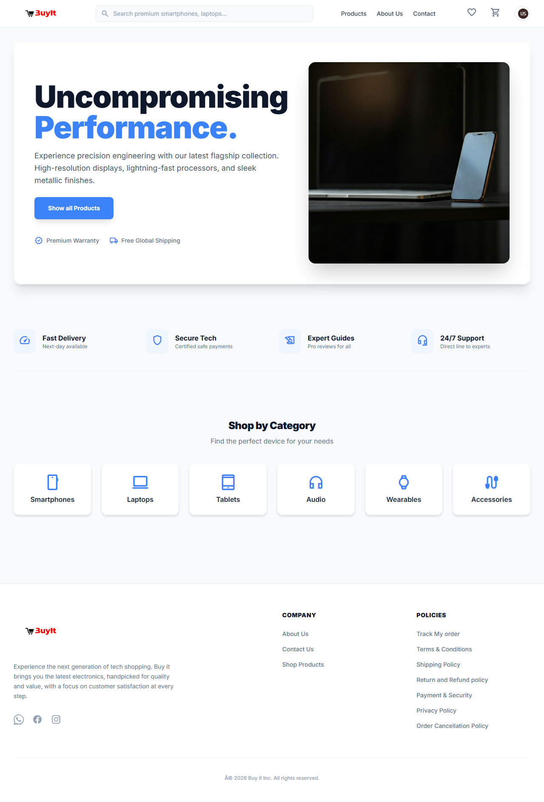
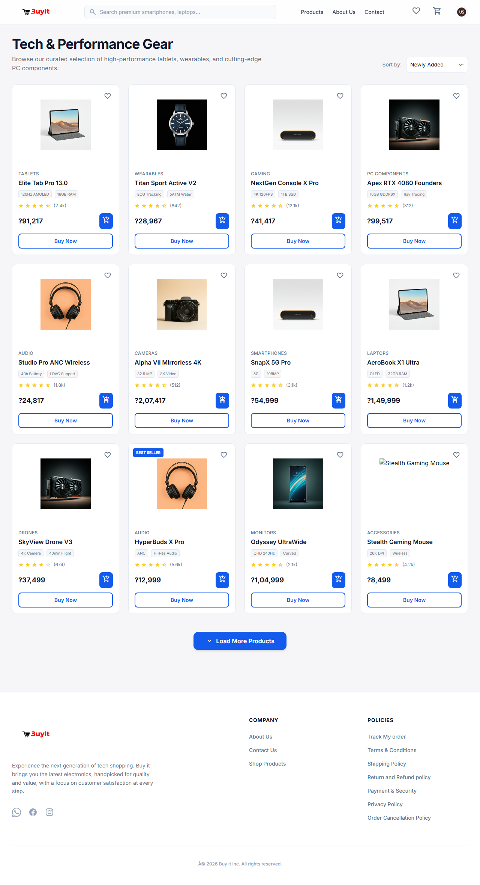
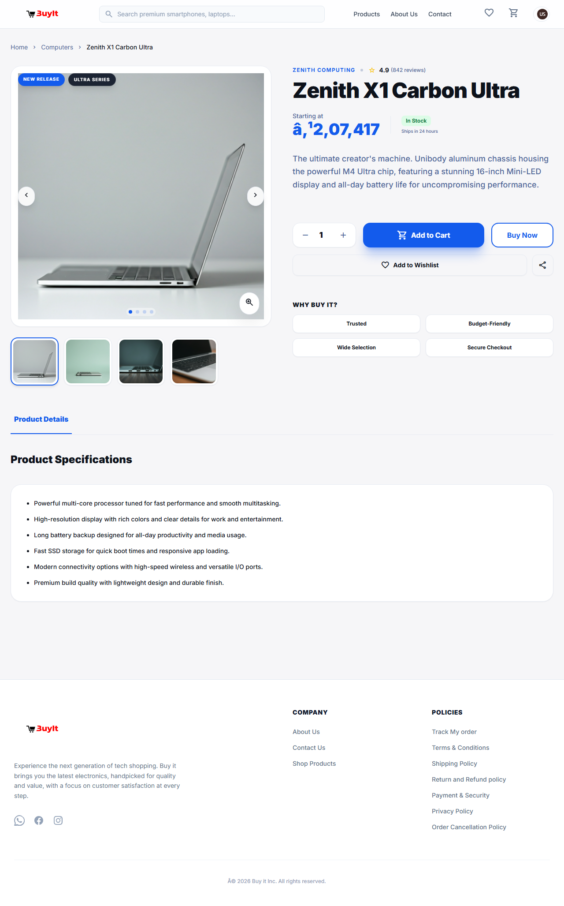
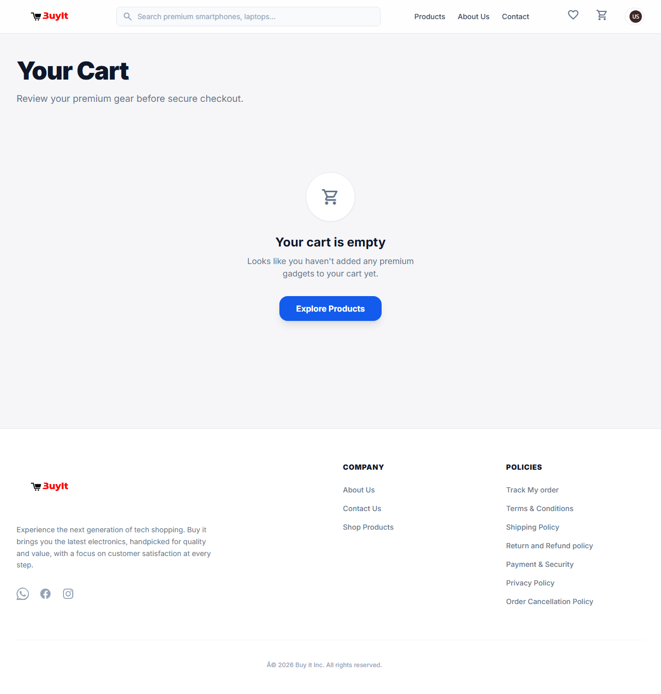
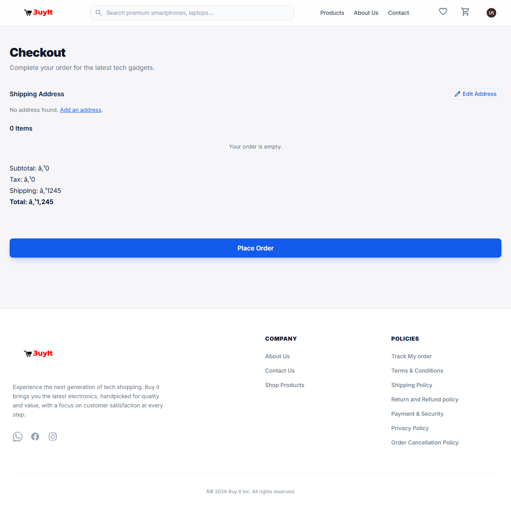
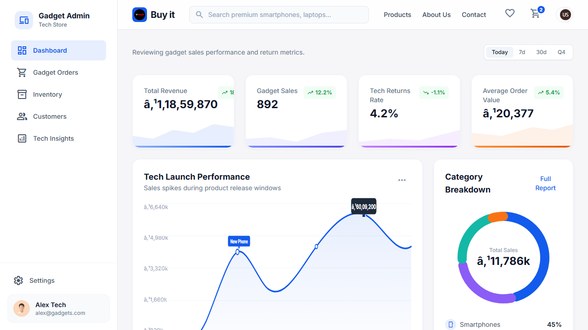

# Buy It — E-Commerce Platform

## Overview

Buy It is a modern, multi-page e-commerce web application built with HTML, CSS, and JavaScript, featuring Firebase integration for authentication, database, and storage. It provides a complete shopping experience for customers and management tools for admins.

---

## Features

- Responsive design for desktop and mobile
- Product catalog, details, cart, and checkout flows
- User account management: login (Phone OTP/Google), profile, addresses, orders, wishlist
- Policy/support pages for real-world UX
- Admin dashboard for products, orders, and settings
- Firebase-powered authentication, Firestore database, and storage
- LocalStorage-based cart and checkout for fast UX

---

## Tech Stack

- **HTML5** — Page structure
- **CSS3** — Styling and responsive layouts (`main.css`, `products.css`, `admin.css`)
- **JavaScript (Vanilla)** — Interactive logic (`shop.js`, etc.)
- **Firebase** — Authentication, Firestore, Functions, Storage

---

## Project Structure

```
├── index.html                # Home page
├── products.html             # Product listing
├── product-details.html      # Product details
├── cart.html                 # Cart page
├── checkout.html             # Checkout page
├── login.html                # Login (Phone OTP/Google)
├── profile.html              # User profile
├── addresses.html            # Address management
├── orders.html               # User orders
├── wishlist.html             # Wishlist
├── admin.html                # Admin dashboard
├── admin-products.html       # Admin product management
├── admin-orders.html         # Admin order management
├── admin-settings.html       # Admin settings
├── main.css                  # Main styles
├── products.css              # Product styles
├── admin.css                 # Admin styles
├── shop.js                   # Storefront logic
├── scripts/                  # Additional JS modules
├── functions/                # Firebase functions
├── firebase-config.js        # Firebase initialization
├── firestore.rules           # Firestore security rules
├── README.md                 # Project documentation
```

---

## Setup & Installation

1. **Clone the repository:**
    ```sh
    git clone <repo-url>
    cd Buy-it
    ```
2. **Install dependencies:**
    - No npm dependencies required for frontend.
    - For Firebase functions, run:
       ```sh
       cd functions
       npm install
       ```
3. **Configure Firebase:**
    - Create a Firebase project.
    - Enable Authentication (Phone, Google).
    - Set up Firestore and Storage.
    - Copy your Firebase config to `firebase-config.js`.
    - Update `firestore.rules` for security.
4. **Deploy:**
    - Host on Vercel, Netlify, or Firebase Hosting.

---

## Usage

### Customer Flow
1. Browse products on the home or products page.
2. Add products to cart or wishlist.
3. Login via Phone OTP or Google.
4. Manage profile, addresses, and orders.
5. Checkout and place orders.

### Admin Flow
1. Login as admin (role set in Firestore).
2. Manage products, orders, and site settings.

---

## Firebase Integration

- **Authentication:**
   - Phone OTP and Google sign-in enabled.
   - Auth state checks protect account/admin pages.
- **Firestore:**
   - Products, orders, users, addresses stored in Firestore.
   - Security rules in `firestore.rules` restrict access.
- **Storage:**
   - Product images and user uploads stored in Firebase Storage.
- **Functions:**
   - Custom backend logic in `functions/`.

---

## LocalStorage Usage

- Cart items are stored in `localStorage` under the key `buyit_cart`.
- Wishlist items in `buyit_wishlist`.
- Selected address ID in `selectedAddressId`.
- Checkout page reads from localStorage for fast UX.

---

## Troubleshooting

- **Google sign-in not working:**
   - Ensure Google provider is enabled in Firebase Authentication.
   - Add your domain to Firebase authorized domains.
- **Products not showing in checkout:**
   - Make sure products are added to localStorage under `buyit_cart`.
   - Check browser console for errors.
- **Address not saving:**
   - Confirm user is signed in.
   - Check Firestore rules and JS imports (use CDN URLs for Firebase modules).

---

## Changelog / Implementation Notes

- All corrections and updates are now documented here.
- Cart and checkout logic uses localStorage for speed and reliability.
- Address selection is synced between addresses.html and checkout.html using localStorage and Firestore.
- All Firebase imports use CDN URLs for browser compatibility.
- Inline styles have been moved to CSS files for best practices.
- Error and success messages are shown near form actions for better UX.
- **[2026-03-04] Checkout now supports direct "Buy Now" purchases:**
    - When a user clicks "Buy Now" on a product, the product is stored in `sessionStorage` under `buyit_buynow` and the checkout source is set to `buyNow`.
    - The checkout page now checks for this and loads the product from `sessionStorage` if present, instead of always loading from the cart.
    - This ensures the selected product appears in checkout when using "Buy Now".

---

## License

MIT License
   - Enable **Google** provider
- **Authentication → Settings → Authorized domains**
   - Add `localhost`
   - Add your production domain (for example, `buy-it-shop.netlify.app`)
- **Firestore Database**
   - Create database in production mode
   - Select nearest region for your users
   - Deploy rules/indexes from project (`firestore.rules`, `firestore.indexes.json`)
- **Storage**
   - Enable Firebase Storage in the same regional family
   - Upload product images under `products/...` paths
   - Deploy storage rules to allow controlled access

---

## 📁 Project Structure

```text
Buy it/
├─ index.html
├─ products.html
├─ product.html
├─ cart.html
├─ checkout.html
├─ account.html
├─ profile.html
├─ admin.html
├─ admin-orders.html
├─ admin-products.html
├─ admin-settings.html
├─ main.css
├─ products.css
├─ admin.css
├─ shop.js
└─ screenshots/
   ├─ home.png
   ├─ products.png
   ├─ product.png
   ├─ cart.png
   ├─ checkout.png
   ├─ profile.png
   └─ admin.png
```

---

## 🚀 Run Locally

1. Open terminal in the project folder.
2. Start a static server:

```bash
npx --yes serve . -l 5500
```

3. Visit:

```text
http://localhost:5500
```

---

## 🖼️ Website Screenshots

### Home + Products

| Home Page | Products Page |
|---|---|
|  |  |

### Product + Cart

| Product Details | Shopping Cart |
|---|---|
|  |  |

### Checkout + Profile

| Checkout | User Profile |
|---|---|
|  |  |

### Admin Panel

| Admin Dashboard |
|---|
|  |

---

## 📄 Pages Included

### Storefront
- `index.html`
- `products.html`
- `product.html`
- `devices.html`
- `cart.html`
- `checkout.html`
- `payment.html`

### User & Account
- `login.html`
- `account.html`
- `profile.html`
- `addresses.html`
- `orders.html`
- `wishlist.html`

### Admin
- `admin.html`
- `admin-products.html`
- `admin-orders.html`
- `admin-settings.html`

### Info / Legal
- `about.html`
- `contact.html`
- `privacy-policy.html`
- `terms-and-conditions.html`
- `shipping-policy.html`
- `return-and-refund-policy.html`
- `order-cancellation-policy.html`
- `payment-and-security.html`

---

## 🔮 Next Improvements

- Add backend APIs for products, cart, checkout, and authentication
- Connect admin pages to live inventory/order data
- Add form validation and error handling across all user flows
- Add accessibility enhancements (ARIA labels, keyboard navigation checks)
- Add deployment pipeline (GitHub Pages, Netlify, or Vercel)

---

## 👤 Author

Built by **Gurudeep**.

If you like this project, consider adding ⭐ on GitHub.